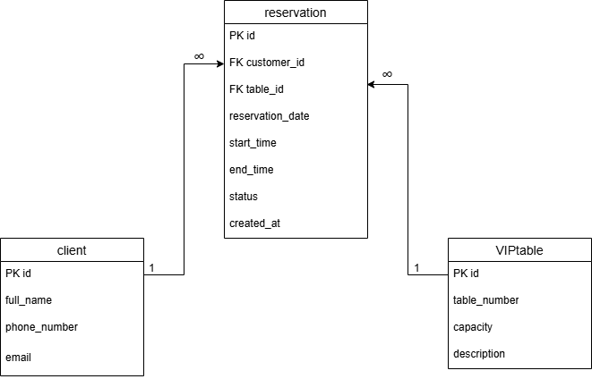
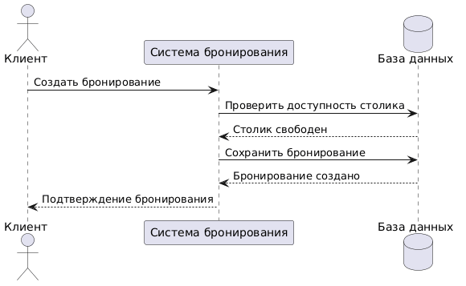
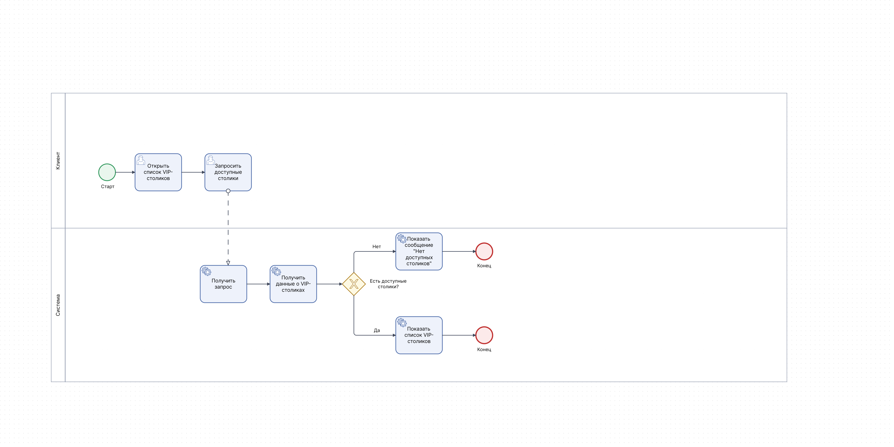

# Система бронирования VIP-столиков

## О проекте

Учебный проект по системному анализу, посвященный проектированию системы бронирования VIP-столиков в ресторане.

Цель проекта — проработка полного цикла анализа требований и моделирования системы: от сбора требований до проектирования бизнес-процессов, структуры данных и API.

В рамках проекта были выполнены:

- анализ предметной области;
- описание функциональных требований;
- описание нефункциональных требований;
- разработка пользовательских сценариев (Use Cases);
- моделирование бизнес-процессов в BPMN;
- построение UML-диаграммы вариантов использования (Use Case Diagram);
- построение UML-диаграммы последовательности (Sequence Diagram);
- проектирование структуры данных и ER-диаграммы;
- проектирование REST API системы.

## Основные возможности системы

- просмотр списка VIP-столиков;
- просмотр доступности столиков;
- создание бронирования;
- подтверждение бронирования менеджером;
- отмена бронирования;
- хранение информации о клиентах и бронированиях.

## Роли пользователей

### Клиент

Клиент использует систему для поиска и бронирования VIP-столиков.

**Возможности:**

- просмотр списка VIP-столиков;
- просмотр доступности столиков;
- создание бронирования;
- отмена бронирования;
- просмотр информации о своих бронированиях.

### Менеджер

Менеджер отвечает за обработку бронирований и управление их статусами.

**Возможности:**

- просмотр списка бронирований;
- подтверждение бронирований;
- просмотр информации о клиентах;
- контроль актуальности данных о бронированиях.

## Используемые инструменты

- GitHub
- Draw.io
- PlantUML
- BPMN
- UML
- Markdown

## Документация

- [Функциональные требования](docs/functional-requirements.md)
- [Нефункциональные требования](docs/non-functional-requirements.md)
- [Use Cases](docs/use-cases.md)
- [API Specification](docs/api-specification.md)
- [BPMN Диаграммы](docs/bpmn.md)
- [Sequence Diagrams](docs/sequence-diagram.md)

## Диаграммы

### ER Diagram



### Use Case Diagram


### Sequence Diagram



### BPMN - Просмотр VIP-столиков



### BPMN - Создание бронирования


### BPMN - Подтверждение бронирования


### BPMN - Отмена бронирования


## Структура проекта

```text
vip-table-booking-system-analysis
│
├── README.md
│
├── docs
│   ├── functional-requirements.md
│   ├── non-functional-requirements.md
│   ├── use-cases.md
│   ├── api-specification.md
│   ├── bpmn.md
│   └── sequence-diagrams.md
│
└── diagrams
    ├── er-diagram.drawio
    ├── er-diagram.png
    ├── use-case-diagram.puml
    ├── use-cases-diagram.png
    ├── sequence-create-booking.puml
    ├── sequence-create-booking.png
    ├── bpmn-view-vip-table.png
    ├── bpmn-create-booking.png
    ├── bpmn-confirm-booking.png
    └── bpmn-cancel-booking.png
```

## Цель проекта для портфолио

Проект создан для демонстрации навыков:

- системного анализа;
- сбора и документирования требований;
- моделирования бизнес-процессов;
- проектирования структуры данных;
- проектирования REST API;
- работы с UML и BPMN.
